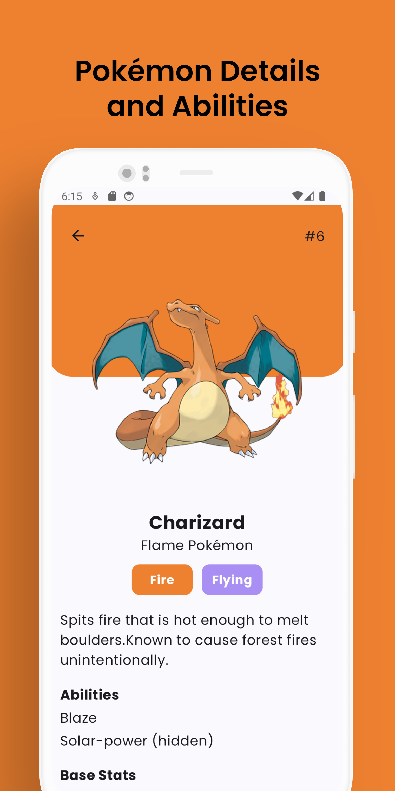
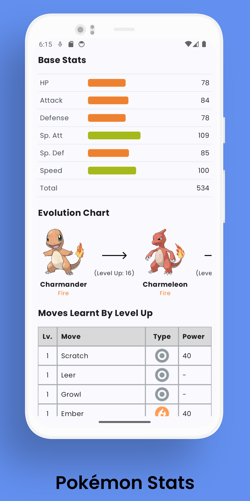
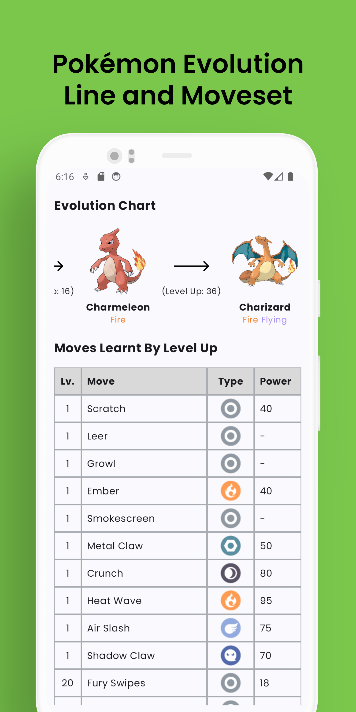
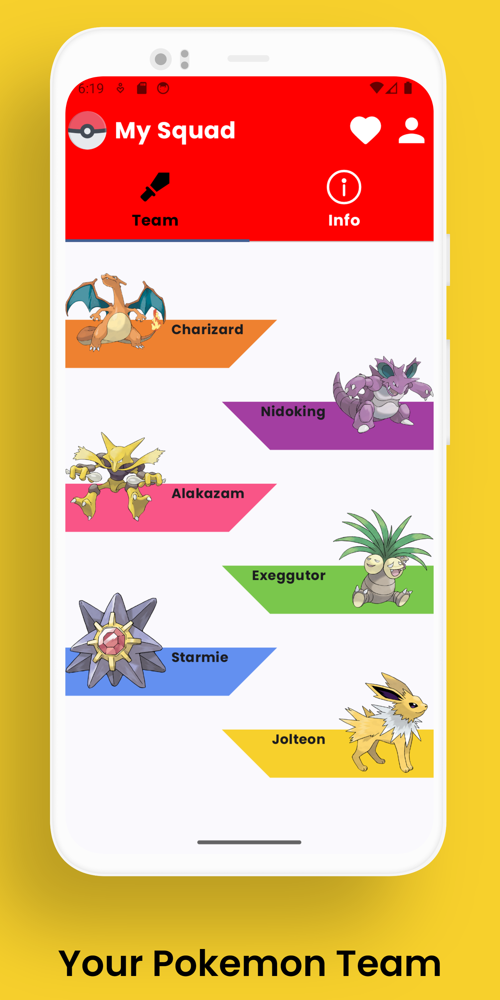
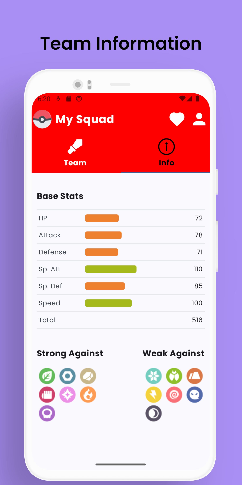

# Pokédex

## About

Pokédex is an android application capable of browsing every single Pokémon in the series. Here, you can also view their details such as typing, abilities, moves, evolution charts, etc. You can also choose 6 pokemons to be a part of your team! This will give you information such as their average base stats and what typing your team is strong and weak against. 

The application was made with MVVM architecture in mind which also implements dependency injection, repository pattern, singleton pattern, etc.

## Credit

This project uses the [Pokéapi](https://pokeapi.co/) for its backend which provides free to use endpoints with the database of all pokemon, hence this project wouldn't be possible without the creators of Pokéapi. You can view their github [here](https://github.com/PokeAPI/pokeapi).

## App Screens

  

    

## Tech Stack

- Android Jetpack Compose
- Kotlin Features (Coroutines, Flow, etc)
- Coil (Async Images and Gif)
- Navigation Compose
- View Model Compose (MVVM architecture)
- Dagger Hilt (Dependency Injection)
- Retrofit (Http Client)
- Paging3
- Room

